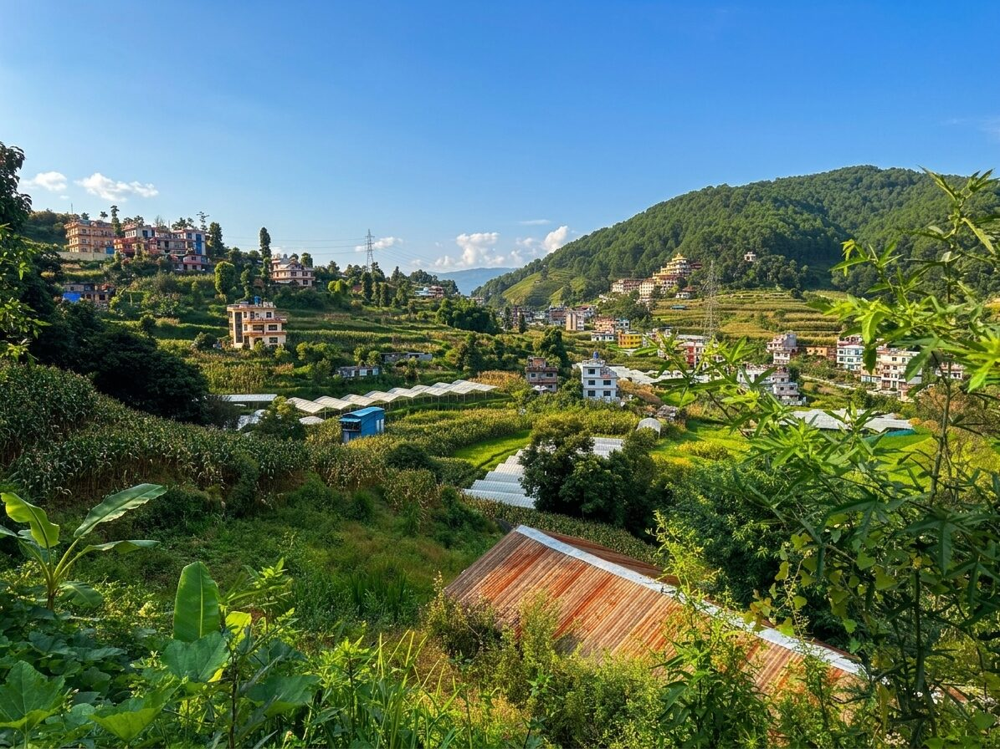
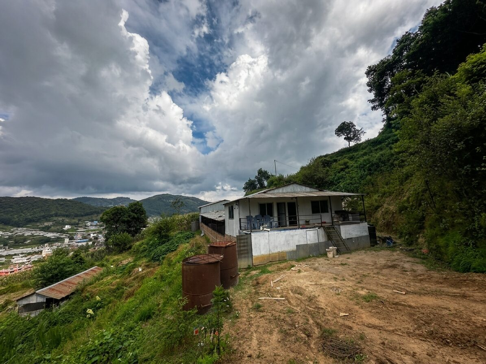
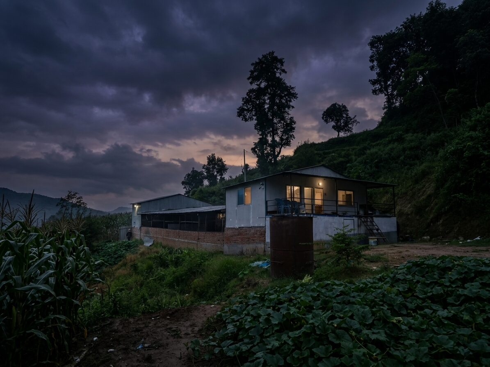

# 🌿 Sanam Sarita Krishi tatha Pashupanchhi Farm

## 📄 Description                                     

This repository contains the source code for the **official website** of Sanam Sarita
Krishi tatha Pashupanchhi Farm, a real agricultural farm in **Nala, Banepa, Nepal**.

The site is a premium, editorial-style **React + Vite + Tailwind CSS** website built to
showcase the farm's diverse crops, its landscape, and its everyday life — combining
authentic HD photographs taken on site with high-quality botanical photography for
individual crops.



## 🖥️ Preview

| Hero | Farm at Dusk |
|------|--------------|
|  |  |

## 📁 Project Structure

| Sr. | Section | Component File |
|-----|---------|-----------------|
| 1 | Sticky navigation bar | `Navbar.jsx` |
| 2 | Cinematic hero | `Hero.jsx` |
| 3 | Farm introduction | `About.jsx` |
| 4 | Landscape & surroundings | `FarmLandscape.jsx` |
| 5 | Filterable crop collection | `WhatWeGrow.jsx`, `CropCard.jsx` |
| 6 | Editorial featured crop stories | `FeaturedCrop.jsx` |
| 7 | Farm life collage | `FarmLife.jsx` |
| 8 | Farm structure showcase | `FarmStructure.jsx` |
| 9 | Atmospheric night section | `NightMoment.jsx` |
| 10 | Cattle / cow shed | `Livestock.jsx` |
| 11 | Goat history (past livestock) | `GoatHistory.jsx` |
| 12 | Photo gallery with lightbox | `Gallery.jsx`, `Lightbox.jsx` |
| 13 | Seasonal changes | `Seasons.jsx` |
| 14 | Location & directions | `Location.jsx` |
| 15 | Contact form | `Contact.jsx` |
| 16 | Footer | `Footer.jsx` |
| — | All content (crops, photos, copy) | `src/data/farmData.js` |

## ⚙️ Requirements

- **Node.js** 18+ and npm
- A modern browser
- A code editor (VS Code recommended)

## ▶️ How to Run

1. Clone the repo:
   ```bash
   git clone https://github.com/<your-username>/sanam-sarita.git
   cd sanam-sarita
   ```
2. Install dependencies:
   ```bash
   npm install
   ```
3. Start the dev server:
   ```bash
   npm run dev
   ```
4. Build for production:
   ```bash
   npm run build
   ```
   The static output is generated in `dist/`.

## 🚀 Deployment

The site is a static build and can be hosted for free on:

- **GitHub Pages** — deploy `dist/` via GitHub Actions (see `.github/workflows/`)
- **Vercel** or **Netlify** — connect the repo for automatic deploys on every push

## 🛠️ Tech Stack

- React 19 + Vite
- Tailwind CSS v4
- Framer Motion (animations)
- Lucide React (icons)

## 🌱 Content Covered

- Fruits — Mango, Orange, Guava, Lemon, Kiwi, Avocado, Nepalese Hog Plum (Lapsi)
- Nuts — Macadamia, Pecan
- Spices & Crops — Cardamom, Ginger, Turmeric, Coffee
- Flowers, and the specialty plant **Buddha Chitta**
- Real farm photography — structures, cattle shed, boundary, landscape, and goat history

## 📸 Image Sources

- **Real farm photographs** — taken on site, stored in `src/assets/farm/`.
- **Botanical/crop photography** — sourced from Wikimedia Commons under Creative
  Commons licenses (see `src/data/farmData.js` for individual file credits).

## ✏️ Editing Content

Almost all text, crop descriptions, and gallery captions live in
`src/data/farmData.js`. Update the arrays there and the site updates automatically —
no need to touch individual components.

## 🤝 Contributing

This is the working repository for the farm's official website. Suggestions and
fixes are welcome — feel free to open an issue or pull request.

## 📬 Contact

Sanam Sarita Krishi tatha Pashupanchhi Farm
Nala, Banepa 45210, Nepal
[Find us on Google Maps](https://maps.app.goo.gl/eDxc4zr1W8mKDwEQ9)

> ⚠️ **Note:** Farm details such as size, founding year, livestock counts, and
> production figures are intentionally omitted until verified information is
> provided — nothing on this site is invented.

Thank you for visiting! 🌾
